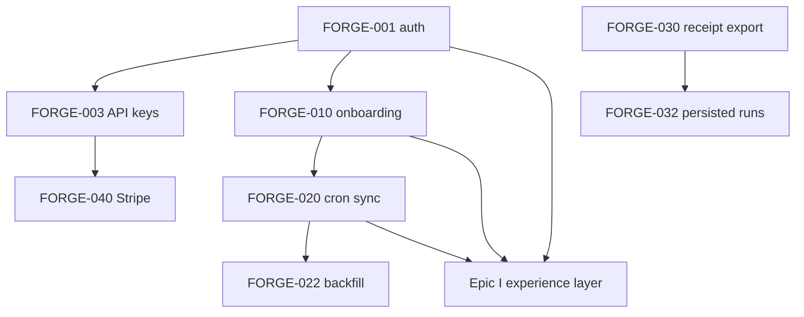

# Forge — Customer readiness backlog

**Purpose:** Actionable epics and stories to take Forge from **engineering demo → paid pilots → production SaaS**.  
**Companions:** [`PRODUCT_PRD.md`](PRODUCT_PRD.md), [`SITE_IMPROVER_VISION_PRD.md`](SITE_IMPROVER_VISION_PRD.md), [`PHASE2_EVIDENCE_MODEL.md`](PHASE2_EVIDENCE_MODEL.md).  
**Convention:** **`FORGE-xxx`** IDs are logical — map to Linear/Jira/GitHub Issues as needed.

---

## Success definition (commercial)

Pilot is ready when:

1. A customer can **provision an org**, connect **telemetry with least privilege**, and run **insights + audit receipts** without a Forge engineer touching production.
2. Every strong output is **exported or shareable** (JSON + Markdown receipt, optional PDF later).
3. **Access control** guarantees no cross-tenant leakage is **auditable**.
4. There is a **commercial path**: quote → Stripe subscription or invoice → SLA-aligned support channel.
5. The **product surface** lets a user complete the **improver loop**: connect sources → see baseline understanding progress → act on ranked suggestions → **preview** a change where applicable → **measure impact in production** via a defined experiment/measurement path (Forge-orchestrated, customer-owned truth acceptable). **Backend-only capability without UX for this loop is explicitly insufficient for “pilot-ready.”**

---

## Priority tiers

| Tier | Meaning | Target horizon |
|------|---------|----------------|
| **P0** | Blocker for any paying customer | Next sprint-equivalent |
| **P1** | Required for “real product” pilots (10 sites) | 4–8 weeks |
| **P2** | Differentiation & scale | 8–16 weeks |
| **P3** | Enterprise / long tail | Quarterly+ |

---

## Epic A — Identity, access control, and tenancy

**Why:** Today org context is **`x-org-id` + defaults** ([`PRODUCT_PRD.md`](PRODUCT_PRD.md) §6.4) — fine for demos, unacceptable for prod.

| ID | Story | Acceptance criteria | Tier |
|----|-------|---------------------|------|
| **FORGE-001** | **Organizations as first-class** — users belong to orgs; `siteId`/`organizationId` always resolved from auth, never trust client body alone. | DB or IdP linkage: `(user_id → org_id)`; Phase2 routes reject mismatched `(body.siteId × org)`. | P0 |
| **FORGE-002** | **Auth provider** — Clerk, Auth0, or WorkOS (SSO roadmap). Middleware protects `/api/phase*` and operator UIs. | Session JWT / cookies; `@` API routes server-only; webhook for user/org sync. Prefer marketplace integration over DIY. | P0 |
| **FORGE-003** | **Machine-to-machine API keys** — `Authorization: Bearer forge_sk_***` hashed in DB, scopes: `insights:run`, `events:write`, `integrations:manage`. | Rotate, revoke, last-used timestamps; plaintext never stored; tests for revocation. | P0 |
| **FORGE-004** | **Role-based access** — `viewer` / `builder` / `admin` — map to Stripe seat or SSO groups later. | At least viewer cannot mutate site config / secrets. | P1 |
| **FORGE-005** | **Audit log append-only** — who ran insights, changed integration, exported receipt; `actor`, `timestamp`, `resource`, `payload hash`. | Query API + CSV export for enterprise; retained 90 days min. | P1 |

---

## Epic B — Product surface & onboarding

| ID | Story | Acceptance criteria | Tier |
|----|-------|---------------------|------|
| **FORGE-010** | **Guided onboarding** — URL capture, canonical domain, “connect PostHog / Segment”, validate integration, ingest sample window estimate. **Stretch:** optional **GitHub** connect stub (OAuth or PAT instructions) when repo is needed for PR-style suggestions. | Time-to-first-`trustworthy:true` or explicit “blocked” receipts < 24h assisted. | P0 |
| **FORGE-011** | **Improver cockpit shell (single-site)** — one overview: **integration health / last sync**, **gate status**, **running or queued jobs** (sync, snapshots), **backlog summary** of open findings, CTAs **Run audit**, **Export receipt**, and entry points to **Preview** / **Measure** (wired or clearly labeled placeholder). *Not* a page builder canvas. | Operators never need a fragmented `/phase1` vs `/phase2` mental model to answer “what should I do next?” | **P0** (elevated: required to operationalize backend value) |
| **FORGE-012** | **In-app methodology** ([`SITE_IMPROVER_VISION_PRD.md`](SITE_IMPROVER_VISION_PRD.md) §8–9) — versioning of gate rules linked from UI. | Every warning code documented with example fix. | P1 |
| **FORGE-013** | **Email alerts** — Resend templates for gate flip, integration failure (`lastErrorCode`), digest. | Quiet hours configurable. | P2 |

Shipped primitives: `/phase2` UI snapshot, **`POST /api/phase2/insights/receipt`**, `/onboarding` wizard (partial); **full cockpit + preview/measure flow** tracked in **Epic I**.

---

## Epic C — Data plane reliability

| ID | Story | Acceptance criteria | Tier |
|----|-------|---------------------|------|
| **FORGE-020** | **PostHog connector scheduling** — Vercel Cron or Queues-triggered `{ sync }` per integration on interval + backoff on cursor failure. | No manual CURL for pilot refresh; dashboards show freshness SLA. | P0 |
| **FORGE-021** | **Idempotent replay / dead-letter for webhooks** — Segment delivery logged; duplicate `messageId` no double-count. | At-least-once safe; surfaced in integration status. | P1 |
| **FORGE-022** | **Backfill tooling** — one-command window backfill PostHog for historical comparison. | Support answers “why did spike change?” within support bundle. | P1 |
| **FORGE-023** | **Page snapshot refresh job** — schedule re-fetch URLs; hash drift alerting ([`phase2_page_snapshots`](../src/lib/db/schema.ts)). | SPA caveat documented until Epic F. | P1 |

---

## Epic D — Credibility receipts & demos (north star alignment)

| ID | Story | Acceptance criteria | Tier |
|----|-------|---------------------|------|
| **FORGE-030** | **Receipt packet schema** (`forge.receipt.v1`) — stable JSON wrapping `RunInsightsResponse` + `schemaVersion` + `exportedAt`. | Importable offline; semver field in root. **Shipped:** `insights/receipt` JSON path. | P0 |
| **FORGE-031** | **Markdown receipt** human narrative for Slack/email. | Sections: window, diagnostics, Phase1 findings, audit findings w/ evidence table. **Shipped:** `format=markdown`. | P0 |
| **FORGE-032** | **Persisted runs** — `phase2_insight_runs` table storing JSON hash + FK org/site/user; list & diff last N runs. | Sales can show “nothing changed overnight except PostHog cursor.” | P1 |
| **FORGE-033** | **Sandbox demo tenant** — read-only seeded project + public landing copy. | GTM scripted demo ≠ customer data leak. | P1 |
| **FORGE-034** | **PDF export** (optional) — print-friendly from Markdown via third-party renderer. | Brand footer “Generated by Forge” + watermark for trial tier. | P3 |

---

## Epic E — Commercial & operations

| ID | Story | Acceptance criteria | Tier |
|----|-------|---------------------|------|
| **FORGE-040** | **Stripe Billing** — products (Seat + Site-metered + Enterprise), customer portal webhooks (`subscription.*`). | No manual license keys; dev/stripe-cli tested. Prefer **third-party Stripe app patterns** vs custom billing UX. | P0 |
| **FORGE-041** | **Plan limits** — max sites, `/insights/run` rate cap, retention window caps on Free tier enforcement. | 429 + `Upgrade` hint; metrics in Postgres. | P0 |
| **FORGE-042** | **Usage metering** — count runs, snapshots, synced events monthly for invoice line items (Stripe metered billing). | Reconcilable with internal logs. | P1 |
| **FORGE-043** | **Status page / incident process** — Vercel + vendor status linkage; playbook for connector outage messaging. | In-app banner when gateway unhealthy (optional). | P2 |
| **FORGE-044** | **Privacy & DPAs** — subprocessors list (Postgres host, Blob, analytics vendors); SCCs if EU pilots. | Signable baseline DPA GitHub/Google Doc PDF. | P1 |

---

## Epic F — Design DNA fidelity (SPA + creative integrity)

| ID | Story | Acceptance criteria | Tier |
|----|-------|---------------------|------|
| **FORGE-050** | **Headless rendered snapshot** pipeline — Browserless / Playwright service behind feature flag; compare static vs rendered diff in audit UI. | Top 100 paths only by traffic to control cost per vision PRD §7 & §15 decisions. | P1 |
| **FORGE-051** | **CSS token fingerprint** extraction into DNA section of receipt (“dominant typography / spacing proxies”). | Not used to flatten design — only to prove per-site deltas. | P2 |
| **FORGE-052** | **Replay deep links** in audit evidence when PostHog supplies session replay URL ids. | One-click receipts “see session clip” gated by OAuth to PostHog. | P2 |

---

## Epic I — Experience layer: connect → understand → preview → measure

**Why:** Phase 1–2 **engines and APIs already produce** readiness, insights, audit findings, and receipts. Without a deliberate **product surface**, customers cannot complete the **improver loop** end-to-end. This epic is **not** “late-stage polish”; it is **parallel** to connector and rule quality. See **`PRODUCT_PRD.md`** §3.1–3.2 and Phase 3.

| ID | Story | Acceptance criteria | Tier |
|----|-------|---------------------|------|
| **FORGE-063** | **Multi-source connection UX** — single guided flow for **canonical URL**, optional **GitHub repo** (install app or paste scope), **PostHog/Segment** (or combination); per-source validation and clear “blocked” states. | User sees which inputs are required vs optional for their stack; failed steps are recoverable without re-entering everything. | P0 |
| **FORGE-064** | **Baseline jobs & progress** — in-app display of **sync / snapshot / rollup** activity (timestamps, errors, cursor freshness) while onboarding and afterward. | Operator answers “is Forge still learning my site?” without reading logs or curl. | P1 |
| **FORGE-065** | **Ranked findings backlog** — one surface listing **audit findings** (and Phase 1 highlights) with severity, path, **link to receipt evidence**, and empty states. | No need to cross `/phase1` and `/phase2` pages to prioritize work. | P0 |
| **FORGE-066** | **Preview v1** — per suggestion (or finding): store **preview artifact** — at minimum **staging URL** and/or **deployment preview URL** and/or **uploaded mock**; primary CTA **Open preview**. | Stakeholders can **see** the proposed change before broad rollout (exact fidelity tier documented in PR). | P0 |
| **FORGE-067** | **Production measurement v1** — **experiment / rollout object**: hypothesis, **primary metric** (name + link to PostHog/funnel), optional flag key, window, **status** (draft / running / completed); stores external ids for auditability. | Team can record **how** production impact will be judged without relying on spreadsheets alone. | P0 |
| **FORGE-068** | **Preview → measure handoff** — one guided flow: from a finding → **Preview** → **Start measurement** (creates/links FORGE-067 record); blocked states if preview or metric missing. | Completes the narrative **“see it → ship it → read results”** inside Forge navigation. | P0 |
| **FORGE-069** | **Variant & lift visualization** — dashboard widgets for **active and past** experiments: baseline vs variant trend, confidence/novelty callouts; creative-friendly layout (not only raw JSON). | Pilot can demo **impact** to leadership from Forge, with links to **customer-owned** analytics for drill-down. | P1 |

**Dependency:** Epic A (auth) for multi-user cockpit; Epic B FORGE-011 should **consume** Epic I patterns or merge into one delivery track.

---

## Epic G — Outcome loops (Phase 3 precursor)

**Note:** Epic **I** delivers the **UI shell** for experiments and measurement; Epic G stories deepen **data model**, exports, and **Git** automation.

| ID | Story | Acceptance criteria | Tier |
|----|-------|---------------------|------|
| **FORGE-060** | **Hypothesis linkage** — user pins PostHog insight URL or funnel id to a finding (`externalReceiptRef`). | Exports cite customer-owned dashboard for lift claims. Complements **FORGE-067**. | P1 |
| **FORGE-061** | **Bet status** — `planned` / `shipped` / `measured` with owner + date; no full PM suite. | CSV export for QBR; ideally **mirrors** lifecycle UI in Epic I. | P2 |
| **FORGE-062** | **GitHub PR draft** (optional) — unified diff from snapshot-scoped text suggestions; **never merge without OAuth approval**. Aligns autonomy L4 guards in vision PRD §6. | Rate-limited; scope per repo whitelist. | P3 |

---

## Epic H — Engineering excellence

| ID | Story | Acceptance criteria | Tier |
|----|-------|---------------------|------|
| **FORGE-070** | **`npm run verify` CI** — `lint`, `tsc --noEmit`, `build`, Postgres migration dry-run smoke on PR. | **Partial:** `npm run verify` locally (see `package.json`); CI workflow + migration smoke still required. GitHub Actions or Vercel checks required for merge on `main`. | P0 |
| **FORGE-071** | **Staging environment** — separate Postgres + env secrets; seeded non-prod telemetry. | Parity checklist before prod rollout. | P1 |
| **FORGE-072** | **Observability** — OpenTelemetry spans on connector sync & insights pipeline; `@vercel/otel` baseline. | p95 latency SLO dashboard; error budget alerting. | P1 |
| **FORGE-073** | **E2E harness** — Playwright spins local Next + hits golden run creating frozen snap JSON for regression audits. | `auditReport` deterministic from fixture. | P1 |
| **FORGE-074** | **Load test** — k6 bursts on Phase2 ingestion + rollup to find DB hot paths; index review on `phase1_events`. | Capacity story for Pilot N concurrent sites. | P2 |

---

## Dependency graph (simplified)

---

## Suggested execution order (first 60 days)

| Week block | Focus |
|------------|--------|
| **1–2** | FORGE-001, 002, 003, 070 — auth + API keys + CI gate |
| **3–4** | FORGE-020, 010, 041 — ingestion reliability + onboarding + quotas **∥ spike Epic I** (FORGE-063, 065, 066, 067, 068 shells — wire to existing APIs even if preview is “link out” only) |
| **5–6** | FORGE-011 cockpit + Epic I hardening + FORGE-040 Stripe + plan enforcement + staging (071) |
| **7–8** | FORGE-032 persisted runs + FORGE-069 visualization + 012 methodology + observability sparkline (072 starter) |

**Parallel track (mandatory, not optional):** Epic **I** experience layer alongside data plane work — otherwise backend capabilities stay inaccessible to paying pilots.

Parallel track: Epic F spikes if ICP skews SPA-heavy sooner.

---

## Out of scope reminder (commercial)

Aligned with **[site improver positioning](SITE_IMPROVER_VISION_PRD.md):**

- Replacing Shopify / CMS authoring,
- Guaranteed lift refunds without externally auditable KPI,
- Silent autonomous production merges without approvals.

---

*Living document — trim or expand as roadmap locks.*
